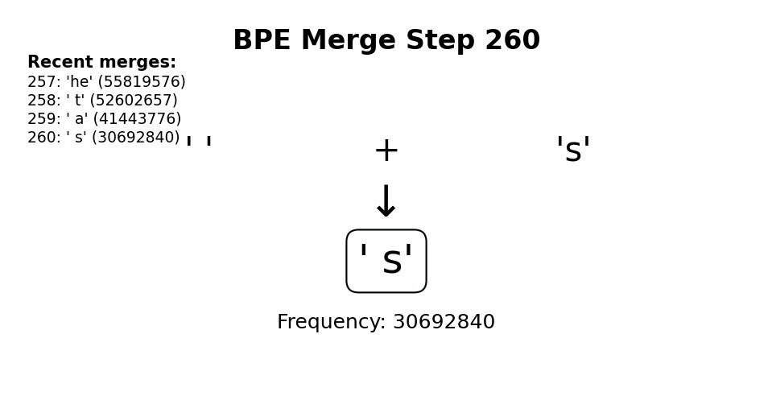

# BPE from Scratch

A simple byte-level Byte Pair Encoding (BPE) tokenizer implemented in Python.
This project is for **learning purposes** only.



---

## Overview

1. Read corpus in chunks.
2. Pre-tokenize text with regex.
3. Convert text to bytes.
4. Learn BPE merges based on frequency.
5. Encode text with learned merges.
6. Decode tokens back to text.

---

## Functions

* `save_vocab_and_merges(vocab, merges_list, file_name)` — save vocabulary and merges.
* `find_chunk_boundaries(file, desired_num_chunks, split_special_token)` — split corpus into chunks.
* `train(global_word_counts, new_token_int, target_vocab_size)` — learn BPE merges.
* `encode(text, merges_list)` — convert text to token IDs.
* `decode(token_seq, reverse_merges)` — convert token IDs back to text.
* `validate(validation_file_path, merges_list, reverse_merges)` — check encoding/decoding on validation set (~43 min, single-threaded).

---

## Regex

```regex
'(?:[sdmt]|ll|ve|re)| ?\p{L}+| ?\p{N}+| ?[^\s\p{L}\p{N}]+|\s+(?!\S)|\s+
```

Used to split words, numbers, punctuation, and whitespace.

---

## Notes

* This implementation is **single-threaded**. All training, encoding, and decoding run in a single process.
* Decoding the validation set took approximately **43 minutes**; this is expected given the byte-level operations and lack of optimization.
* No parallelism or advanced performance tricks are added—this is intentional to **focus on understanding BPE**.
* Byte-level tokenization ensures **full vocabulary coverage**, avoiding out-of-vocabulary issues.
* Regex-based pre-tokenization keeps merges within meaningful text chunks, making training more manageable and the learned tokens more logical.
* Optimizations like parallel processing, vectorized merges, or faster I/O are left as future improvements.


